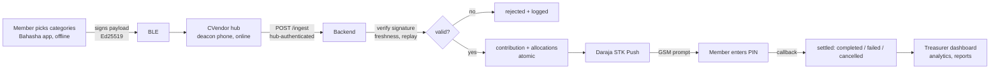

# Bahasha Ecosystem

Offline-first digital giving for churches. Members choose contribution
categories without mobile data; the metadata crosses to a church hub over
Bluetooth Low Energy; the backend triggers an MPESA STK Push that reaches the
member's handset over GSM. No manual Paybill entry, no typing errors, no
misallocations.

## Systems

| Project                | Stack                                   | Who uses it        | Status |
|------------------------|-----------------------------------------|--------------------|--------|
| `backend/`             | Node · Express · TypeScript · Supabase  | (infrastructure)   | **Built & tested** |
| `bahasha-mobile/`      | Flutter (Android-first)                 | Church members     | In progress |
| `cvendor-mobile/`      | Flutter (background BLE hub)            | Church deacons     | Planned |
| `treasurer-dashboard/` | Next.js · TS · Tailwind · shadcn        | Church treasurers  | Planned |
| `documentation/`       | Markdown, diagrams                      | Developers         | In progress |

## How a contribution flows



See [`documentation/protocol/ble-protocol.md`](documentation/protocol/ble-protocol.md)
for the wire format and threat model, and
[`documentation/architecture/database-erd.md`](documentation/architecture/database-erd.md)
for the data model.

## What is verified today

This project is built test-first against real infrastructure, not scaffolded.

- **Database** — 9 migrations apply cleanly to real Postgres 15; **30 schema
  invariants + 14 ingest/settlement tests pass** (`backend/supabase/test`),
  including the anonymity guarantee, atomic money pipeline, replay defence, and
  idempotent MPESA callbacks.
- **Backend** — compiles under strict TypeScript; **16 crypto/phone unit tests
  pass with real generated keypairs** (tampered amounts and forged signatures
  are rejected); boots and connects to a live Supabase project.

Run it yourself: [`documentation/guides/testing.md`](documentation/guides/testing.md).

## Getting started

1. **Backend** — see [`documentation/guides/setup.md`](documentation/guides/setup.md).
   Copy `backend/.env.example` to `backend/.env`, fill in Supabase + Daraja
   values, then:
   ```bash
   cd backend
   npm install
   npm run db:migrate   # applies schema + seed to your Supabase project
   npm run dev
   ```
2. **Deployment** — [`documentation/guides/deployment.md`](documentation/guides/deployment.md)
   (backend → Render, dashboard → Vercel, database → Supabase).

## Security posture (summary)

- Givers prove identity by **device signature**, never a shared secret. The hub
  is a transport, not a trust authority.
- Secret givers are visible to their treasurer only as a stable pseudonym; only
  a Bahasha super admin can resolve them, and every resolution is logged.
- Money cannot move for a church without a configured MPESA shortcode.
- Secrets live only in the gitignored `.env`; the config layer refuses to boot
  on missing/placeholder values and forbids sandbox Daraja in production.

## Repository layout

```
Bahasha-Ecosystem/
├── backend/               # API, BLE ingest, Daraja, Supabase schema + tests
│   ├── src/               # config, lib, middleware, routes, services, domain
│   ├── supabase/          # migrations, seed, SQL tests
│   └── scripts/           # migration runner
├── bahasha-mobile/        # Flutter member app (pixel-perfect Figma)
├── cvendor-mobile/        # Flutter deacon hub app
├── treasurer-dashboard/   # Next.js analytics dashboard
└── documentation/         # architecture, api, protocol, guides
```

## License

Proprietary. © Bahasha. All rights reserved.
