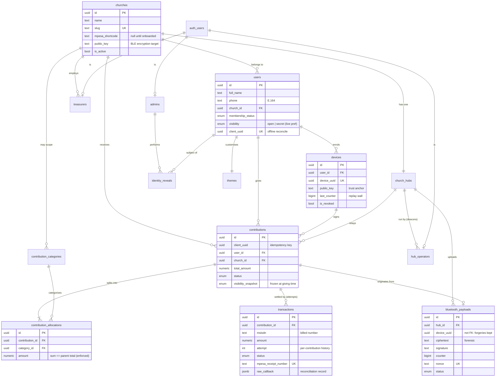

# Bahasha Database — ERD & Design Notes

The full schema lives in [`backend/supabase/migrations`](../../backend/supabase/migrations).
This document explains the shape and the non-obvious decisions. It is verified
against real Postgres by
[`backend/supabase/test`](../../backend/supabase/test) — 30 schema invariants and
14 ingest/settlement tests.

## Entity relationships

*`auth_users` is Supabase's `auth.users`; staff tables key off it. Givers do
**not** — they authenticate by device signature, not by login.*

## Load-bearing design decisions

### Anonymity is snapshotted, not live
`users.visibility` is the member's current preference. Analytics **never** reads
it. Each contribution freezes `visibility_snapshot` at giving time. Without this,
a member switching to "Give Openly" would retroactively expose every past secret
gift. Enforced by masking views + RLS; tested in `01_invariants_test.sql`.

### Allocations must sum to the total
A deferred constraint trigger asserts `sum(allocations) == total_amount` at
commit, from both sides (child insert and parent update). Charging one figure
and crediting another is the worst possible bug in a giving system.

### One hub per church
A unique index on `church_hubs.church_id`. Multiple deacons registering under a
church all attach to that one hub, so every offering routes to the same place.

### No shortcode, no money
A `BEFORE INSERT` trigger on `transactions` refuses any transaction for a church
with a null `mpesa_shortcode`. A fresh environment physically cannot move money
until a real paybill is configured — which is why the seed leaves shortcodes
null rather than using a placeholder.

### Replay defence is in the database
`bluetooth_payloads` has unique indexes on `(device_uuid, counter)` and on
`nonce`. Even a byte-perfect replay with a valid signature fails to insert.
Cryptography proves authenticity; the database proves freshness.

### The audit trail is immutable
`audit_logs` and `identity_reveals` have SELECT-only RLS for admins and **no**
UPDATE or DELETE policy for anyone, including super admin. Every reveal of a
secret giver's identity is itself logged, with a mandatory justification.

## Indexing

Every foreign key used in a hot read path is indexed; analytics breakdowns
(church × visibility × time, church × received_at) have composite indexes;
"in-flight" states (`pending`, `processing`, `rejected`) use partial indexes so
the common rows stay out of them. See each migration for the specific set.

## Row Level Security

RLS is enabled and FORCED on every table. The Express API uses the service-role
key (bypasses RLS by design — it performs signature verification no client may
do); the treasurer dashboard connects with the anon key and is fully governed by
the policies in `0007_rls.sql`. A bug in the API must not become a data breach,
so RLS is defence in depth, not the only defence.
